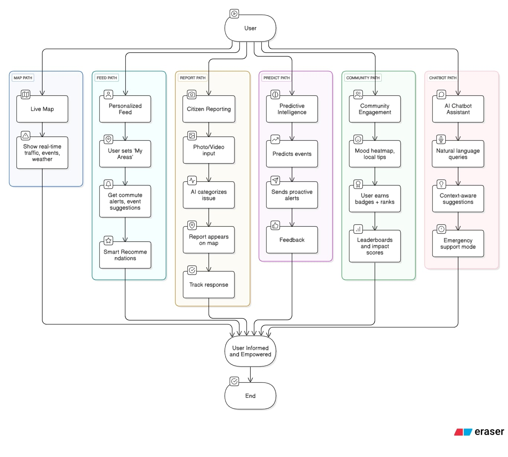

# 🌆 City Pulse — Real-Time Urban Intelligence  
**Google Cloud Agentic AI Day Hackathon 2025** • Top 700 / 9 100 teams • Guinness-certified largest generative-AI hackathon

---

## 1 | Problem

Cities like Bengaluru spew out torrents of information every minute, yet the data is *fragmented, noisy and late* — tweets, news flashes and citizen reports pile up faster than officials can react, leading to poor situational awareness and slow response.

---

## 2 | Solution

City Pulse unifies those scattered signals into a single, living dashboard:

* Ingests real-time feeds from social, IoT sensors and user uploads.  
* Uses AI agents to clean, deduplicate and correlate events while learning from feedback.  
* Visualises the city’s “pulse” on an interactive map and pushes predictive, personalised alerts to every stakeholder — commuters, planners, first-responders.

---

## 3 | Key Features

| Module                | Capability |
|-----------------------|------------|
| **Live Pulse Map**    | Continuous map overlays for traffic, events and weather |
| **Smart City Feed**   | Personalised alerts, event tips and adaptive recommendations |
| **Civic Report Hub**  | Geo-tagged photo/video reporting with AI auto-classification and issue tracking |
| **Predictive Intelligence** | Early-warning forecasts and feedback-driven model updates |
| **Community Connect** | Mood heat-maps, tips, badges and local leaderboards |
| **CityBot Assistant** | Natural-language Q&A plus emergency support mode |

---

## 4 | Architecture

---

## 5 | User Flow

---

## 6 | Tech Stack

| Layer            | Tools / Services |
|------------------|------------------|
| Front-end        | React or Next.js |
| Back-end         | FastAPI (Python) |
| Realtime Store   | Firebase (Firestore, Realtime DB, Auth) |
| Vector Search    | Vertex AI Vector Search |
| AI Services      | Gemini LLM, `text-embedding-3-small`, `embed-english-v3.0`, LangGraph orchestration |
| External APIs    | Google Maps, X/Twitter sentiment stream |
| Deployment       | Firebase Hosting (frontend) • Cloud Run (backend) |

---

